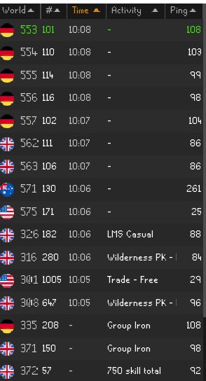

# World Finder
A world hopper which adds a column to sort by when a world was last visited. This is useful to avoid hopping to 
worlds you've already checked when looking for a free world. Also works with the party plugin to show when
anyone in the party was last in the world.

